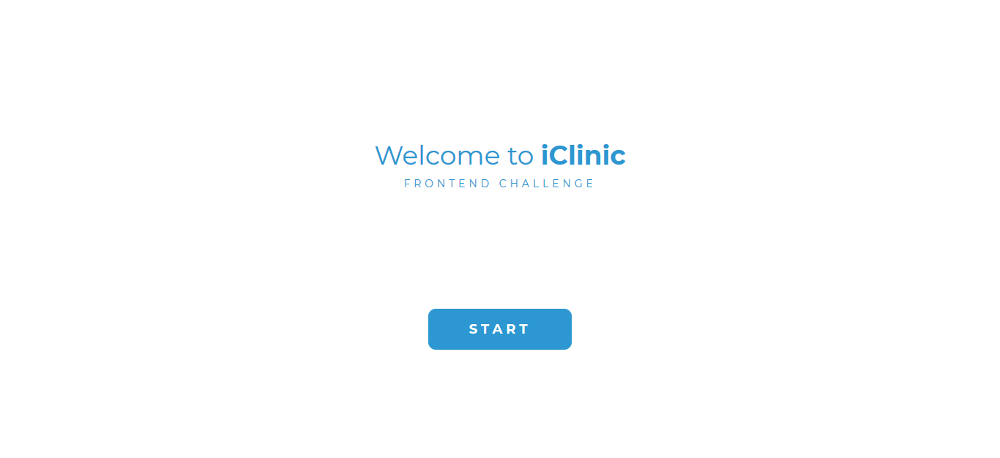
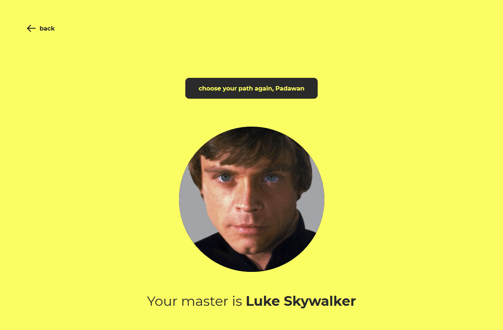
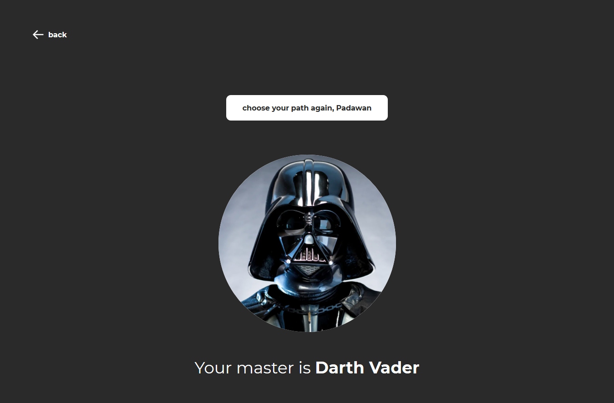

# Teste da iClinic

Fiz este no projeto no intuito de praticar e aprender as tecnologias que usei para desenvolve-lo.

O projeto foi baseado em um teste para desenvolvedores front-end, feito pela empresa [iClinic](https://iclinic.com.br/).

[Link para o repositório do teste](https://github.com/iclinic/challenge-front).

### Tecnologias utilizadas

- [ReactJS](https://pt-br.reactjs.org/)
- [Typescript](https://www.typescriptlang.org/)
- [Jest](https://jestjs.io/)
- [React Testing Library](https://testing-library.com/docs/react-testing-library/intro/)
- [Storybook](https://storybook.js.org/)

## Sobre

Com base em duas requisições feita à uma [API](https://swapi.dev/api/) do Star Wars que irão retornar dados do [Luke Skywalker](https://swapi.dev/api/people/1/) ou do [Darth Vader](https://swapi.dev/api/people/4/), deve ser exibido ao usuário se ele é do lado sombrio tendo Darth Vader como mestre, ou do lado da luz tendo Luke Skywalker como mestre. A primeira requisão que retorna os dados determina o que será exibido.

## UI

### [Tela 1](./ui/home.png)

- Exibir dois cabeçalhos e um botão.
- Ao clicar no botão, é feita as requisições à API e o usuário é levado para a segunda tela.

<div align="center" >
 
</div>

### [Tela 2](./ui/force-side-mobile.png)

- Exibir um botão para retornar a página inicial. E com base na primeira requisição finalizada, exibir uma tela escura ou clara com uma imagem do mestre (Luke Skywalker/Darth Vader), um cabeçalho informando qual é o mestre e um segundo botão.

- Ao clicar no segundo botão, deve ser feita as requisições novamente e exibir as informações necessárias com base na primeira requisão finalizada.

  | Lado da Luz                     | Lado Sombrio                   |
  | ------------------------------- | ------------------------------ |
  |  |  |

## Como usar

Após clonar o repósitorio, instale as dependências.

```bash
  $ yarn install
  # ou
  $ npm install
```

Após finalizar a instalação das dependências, utilize um dos comandos abaixo:

- `start`: sobe à aplicação em modo desenvolvimento de em `localhost:3000`

- `test`: executa todos os testes

- `test:watch`: executa todos os testes em modo watch

- `storybook`: sobe o storybook em `localhost:6006`
